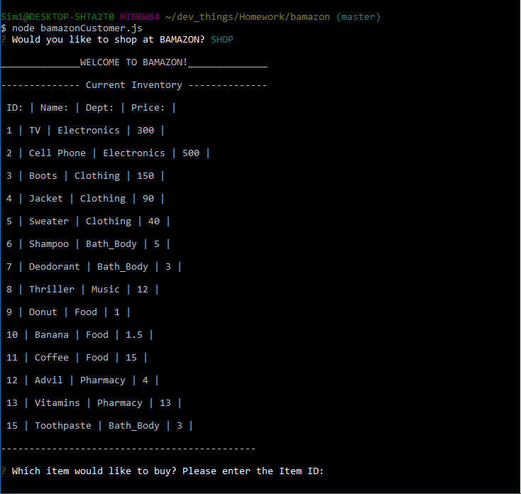

# Bamazon 

Bamazon is a pseudo-shopping store via the command line.

### How Bamazon works
Using this app, a customer can shop for various items within Bamazon's inventory. The app will notify them if the item is in stock, and will calculate the total cost of their purchase, depending on how many units they order. If the order is too large, the Bamazon app will let the customer know how many units remain in inventory.

The app is fully functional for management as well.  Manager's can check current inventory, see which items are low in stock, add to the store's current inventory, as well as introduce new product's to the app.

-------------------------------------------------------------------

### Instructions

Customer's input to start up the app will be:
<code>node bamazonCustomer.js</code>

Management's input to start up the management tools will be: 
<code>node bamazonManager.js</code>

----------------------------------------------------------------
Customer's will be greeted with this screen below upon entering the app store:

A display of available inventory will show, and they will be prompted to purchase an item pertaining to it's respective ID#.

---------------------------------------------------------------

A video demonstration of both customer and manager apps is linked below:

<a href="https://drive.google.com/file/d/1wWTufRuxu8we3Qd-Jev1X0vmgOZAf7TZ/view?usp=sharing">Bamazon Demo</a>

### Technologies Involved
* MySQL
* Node.js
* node_modules (Inquirer, MySQL)
* JavaScript
